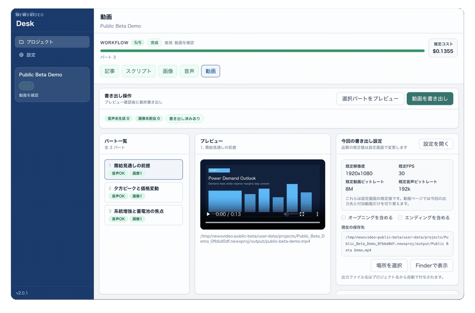
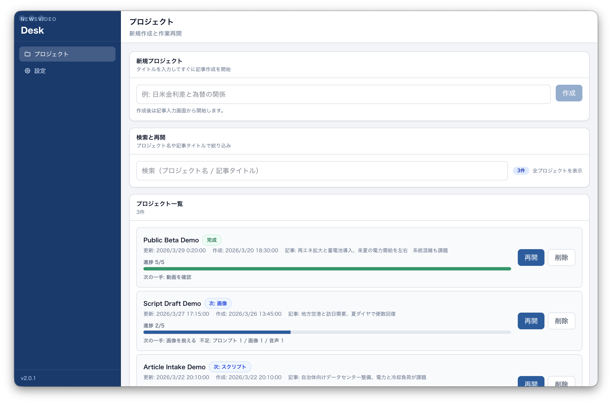
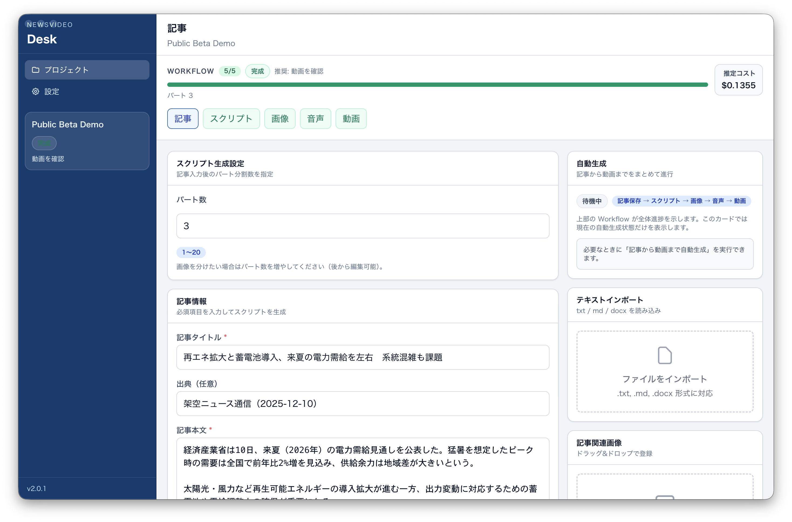
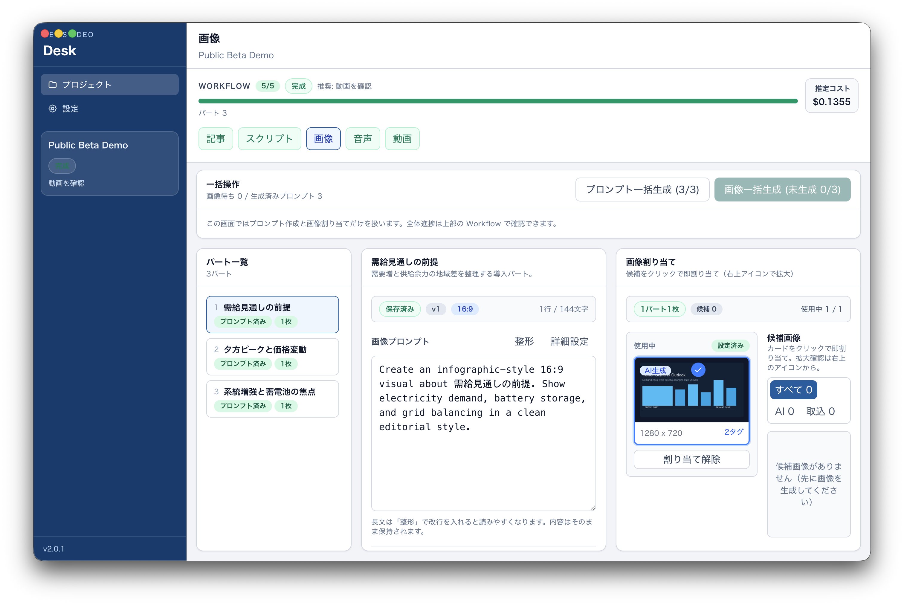
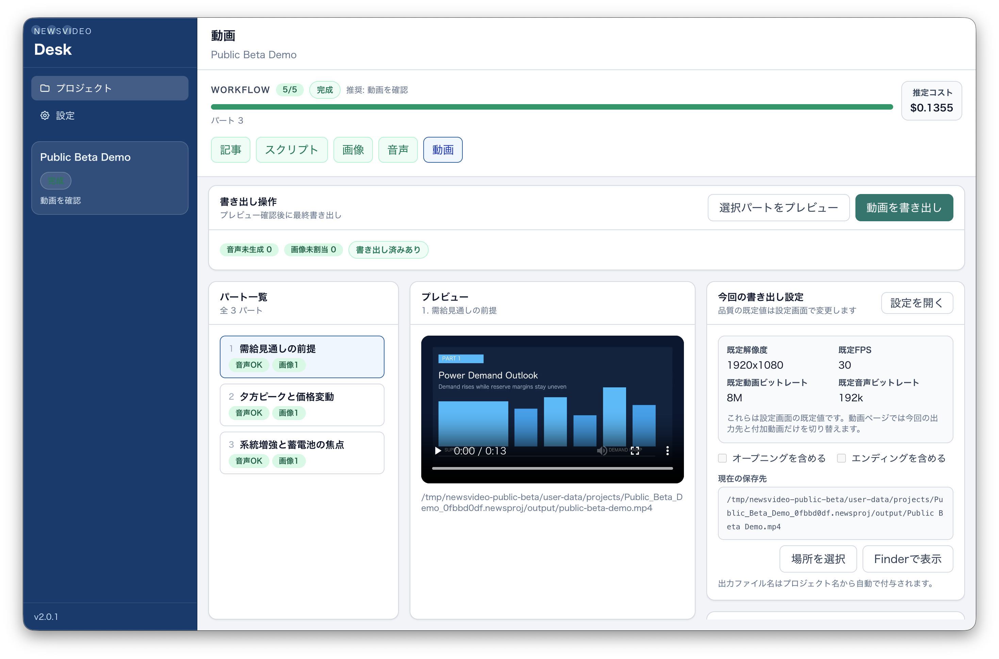

# NewsVideo

NewsVideo は、ニュース記事からナレーション付き動画を作るための `macOS / Apple Silicon` 向けデスクトップアプリです。1つのプロジェクトの中で、記事入力、台本生成、画像生成、音声生成、動画書き出しまでを順番に進められます。

現在は `Public Beta` としての公開を前提に整備中です。サポートは `best effort`、API 利用料はユーザー自身の契約に紐づきます。

## サポート方針

- NewsVideo は個人開発の `OSS Public Beta` です
- サポートは `best effort` で、個別環境ごとの無償セットアップ支援や運用代行は行いません
- まず `README`、`docs/クイックスタート.md`、`docs/対応環境と制約.md` を確認し、そのうえで再現条件がある場合のみ Issue をお願いします
- 外部 API の障害、課金、モデル仕様変更に対して即時対応は保証しません

## 現在サポートしないもの

- `Windows` / `Linux` 向けの利用案内や公式配布
- `Intel Mac` 向けの公式配布
- 個別環境ごとの手厚いセットアップ支援
- 外部 API 障害やモデル仕様変更への即時追従
- 生成結果の固定品質保証や商用 SaaS 相当の継続サポート

## できること

- 記事テキストから複数パートの台本を生成する
- プロジェクトごとに `ニュース / 解説 / 報告 / ショート` の配信スタイルを切り替える
- 締め文を `既定 / なし / カスタム` から選ぶ
- 1パートの目安秒数をプロジェクト単位で調整する
- 画像スタイルを `図解 / エディトリアル / ミニマル / SNS カード` から選ぶ
- 画像アスペクト比を `16:9 / 1:1 / 9:16` から選ぶ
- 音声の話し方を `ニュース調 / 落ち着いた解説 / カジュアル / プロモーション` から選ぶ
- パートごとに画像プロンプトを作り、画像生成まで進める
- ナレーション音声を生成する
- 動画プレビューを確認し、最終動画を書き出す
- プロジェクト単位で途中経過を保存し、あとから再開する
- 進捗と概算コストを画面上で確認する

## 想定ユーザー

- ニュース解説動画を短時間で組み立てたい個人制作者
- 記事ベースの動画試作を高速に回したい編集者や小規模チーム
- SaaS に素材を預けるより、ローカルアプリで制作フローを持ちたい人

## ワークフロー

1. プロジェクトを作成する
2. 記事を貼り付ける、または `.txt` / `.md` / `.docx` を読み込む
3. `配信スタイル`、`締め文`、`1パートの目安秒数`、`画像スタイル`、`画像アスペクト比`、`音声の話し方` を必要に応じて調整する
4. 台本を生成する
5. 画像プロンプトと画像を生成する
6. 音声を生成する
7. 動画をプレビューして書き出す

記事入力画面からは「記事から動画まで自動生成」を実行できます。段階ごとに調整したい場合は、`記事 -> スクリプト -> 画像 -> 音声 -> 動画` の各画面を個別に進められます。

## 使い始める

### 配布版を使う

- 最新版は [GitHub Releases](https://github.com/aoyaman41/NewsVideo/releases/latest) から取得できます
- 現時点の公式配布は `macOS / Apple Silicon (arm64)` 向けです
- 最短手順は [docs/クイックスタート.md](docs/クイックスタート.md) にまとめています
- 初回起動時の Gatekeeper 警告と回避手順は [docs/macOSインストールとGatekeeper.md](docs/macOSインストールとGatekeeper.md) を確認してください
- 対応環境と Public Beta の制約は [docs/対応環境と制約.md](docs/対応環境と制約.md) を確認してください

### 初回設定

1. アプリを起動して `設定` を開く
2. 既定設定のまま使う場合は `OpenAI` と `Google AI` の両方の API キーを登録する
3. 1つのキーで始めたい場合は、文章生成モデルを両方とも `Gemini 3.1 Pro` に切り替えたうえで `Google AI` キーのみ登録する
4. 必要に応じて動画解像度、画像解像度、音声設定を調整する

補足:

- 既定の文章生成モデルは `GPT-5.2`、画像生成と既定の音声生成は Google 側の API を使います
- API 利用料は NewsVideo ではなく、各プロバイダの契約に対して直接発生します

### 最初の1本を作る

1. `プロジェクト` 画面で新規プロジェクトを作成する
2. 記事タイトル、出典、本文を入力する
3. サンプルで試す場合は [docs/サンプル記事.md](docs/サンプル記事.md) をそのまま使う
4. 必要に応じて `配信スタイル`、`締め文`、`1パートの目安秒数`、`画像スタイル`、`画像アスペクト比`、`音声の話し方` を調整する
5. 自動生成を使うか、Workflow に沿って各ステップを進める
6. 動画画面でプレビューと書き出しを行う

## 開発者向けセットアップ

必要環境:

- Node.js `^20.19.0` または `>=22.12.0`
- macOS

起動:

```bash
npm install
npm run dev
```

ビルド:

```bash
npm run build
```

確認用コマンド:

```bash
npm run lint
npm run typecheck
npm test
```

## プレビューとサンプル

- 4画面をつないだ短いデモ: [workflow-demo.gif](.github/assets/public-beta/workflow-demo.gif)
- 公開用のサンプル入力 / 出力まとめ: [docs/サンプル出力.md](docs/サンプル出力.md)
- 記事入力済みのサンプルプロジェクト: [docs/サンプルプロジェクト.md](docs/サンプルプロジェクト.md)
- リリース前の最低限チェック: [docs/リリース前スモークテスト.md](docs/リリース前スモークテスト.md)
- 最新の配布物: [GitHub Releases](https://github.com/aoyaman41/NewsVideo/releases/latest)
- 検証用の入力例: [docs/サンプル記事.md](docs/サンプル記事.md)
- 公開用素材の再生成: `npm run docs:public-assets`



| Project list | Article input |
| --- | --- |
|  |  |
| Image workflow | Video export |
|  |  |

スクリーンショットと GIF は、機密情報や API キーが映らないように隔離プロファイルから自動生成しています。GitHub Releases に添付する場合も `.github/assets/public-beta/` 配下の同じファイルをそのまま使えます。

## 対応環境と制約

- 現時点の公式配布は `macOS / Apple Silicon (arm64)` のみです
- `Windows`、`Linux`、`Intel Mac` 向けの公式配布物はありません
- Public Beta のためサポートは `best effort` です
- 個別環境の無償セットアップ支援や商用サポートは行いません
- AI 生成機能を使うにはインターネット接続とユーザー自身の API キーが必要です
- 画像スタイルと画像アスペクト比はプロジェクトごとに選べます
- 既存プロジェクトに `presentationProfile` がない場合は `news + preset closing` 互換で読み込みます
- 現行の配布フローでは `Developer ID` 署名と `notarization` を意図的に見送っています
- 理由: 個人開発 OSS の現状では Apple Developer Program の年額コストと運用負荷に見合わないためです
- 詳細は [docs/対応環境と制約.md](docs/対応環境と制約.md) にまとめています

## データ取り扱いの概要

- プロジェクトデータはローカルのアプリ用ディレクトリに保存されます
- API キーは Electron の `safeStorage` を使ってローカル暗号化保存します
- 記事本文、生成プロンプト、音声生成用テキストは、生成時に選択した外部 API に送信されます
- 専用のテレメトリ送信やログ収集は現時点ではありません

詳細は [docs/データ取り扱い.md](docs/データ取り扱い.md) にまとめています。

## ドキュメントとサポート

- 現行実装ガイド: [docs/現行実装ガイド.md](docs/現行実装ガイド.md)
- コンテンツカスタマイズ方針: [docs/コンテンツカスタマイズ方針.md](docs/コンテンツカスタマイズ方針.md)
- クイックスタート: [docs/クイックスタート.md](docs/クイックスタート.md)
- データ取り扱い: [docs/データ取り扱い.md](docs/データ取り扱い.md)
- 免責事項: [docs/免責事項.md](docs/免責事項.md)
- FAQ / トラブルシュート: [docs/FAQとトラブルシュート.md](docs/FAQとトラブルシュート.md)
- リリース前スモークテスト: [docs/リリース前スモークテスト.md](docs/リリース前スモークテスト.md)
- 公開リリース手順: [docs/公開リリース手順.md](docs/公開リリース手順.md)
- 対応環境と制約: [docs/対応環境と制約.md](docs/対応環境と制約.md)
- セキュリティ報告方針: [SECURITY.md](SECURITY.md)
- Issue を開く前に、サポート方針と対応範囲を確認してください
- バグ報告 / 要望 / 使い方の質問: [GitHub Issues](https://github.com/aoyaman41/NewsVideo/issues/new/choose)
- 開発参加の前提: [CONTRIBUTING.md](CONTRIBUTING.md)

## 免責事項

- NewsVideo は個人開発の `OSS Public Beta` で、`AS IS` かつ `best effort` で提供します
- 動作継続性、生成結果、外部 API 由来の障害や料金変更、将来の互換性は保証しません
- 公開デモ素材はこのリポジトリ用の架空記事と自動生成図版で構成しており、確認した範囲では第三者ロゴ、写真、記事転載は含んでいません
- 詳細は [docs/免責事項.md](docs/免責事項.md) と [LICENSE](LICENSE) を確認してください

## License

- NewsVideo のソースコードライセンス: [LICENSE](LICENSE)
- 同梱する第三者コンポーネントの注意書き: [THIRD_PARTY_NOTICES.md](THIRD_PARTY_NOTICES.md)
