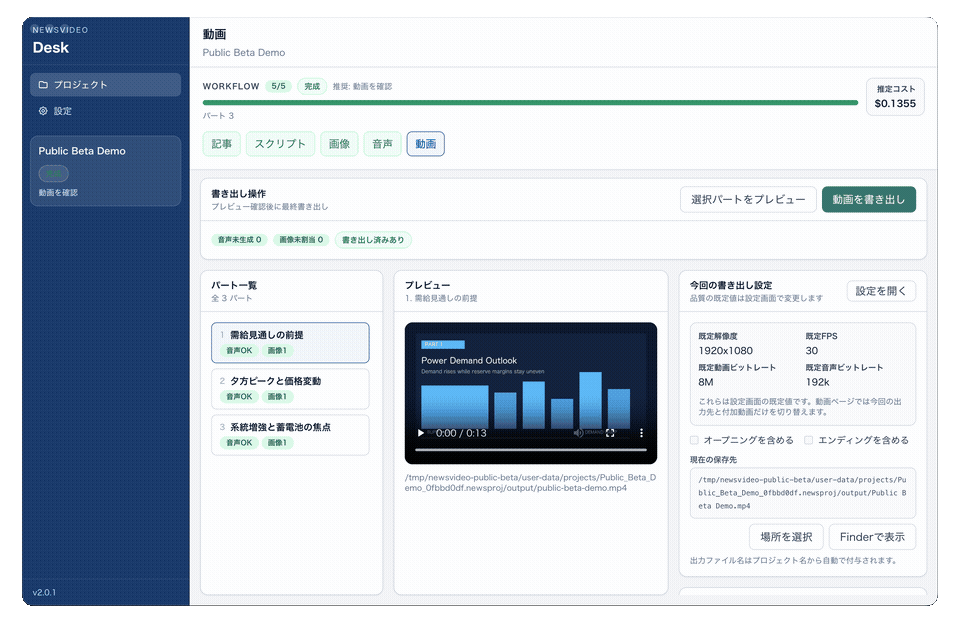
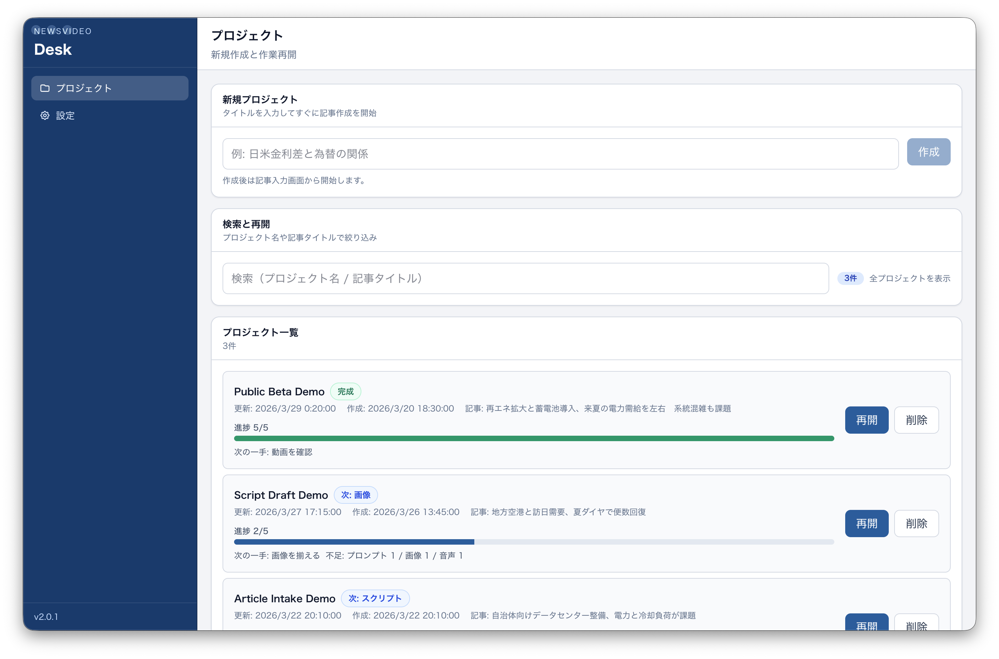
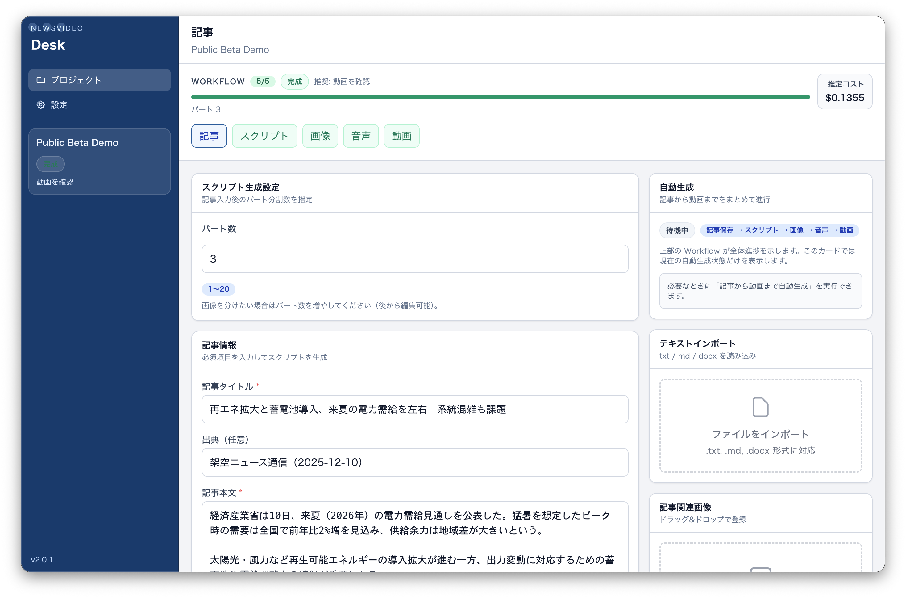
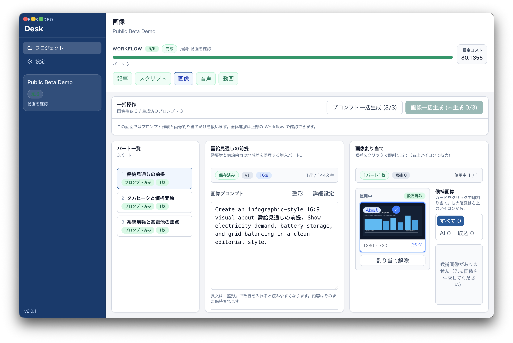
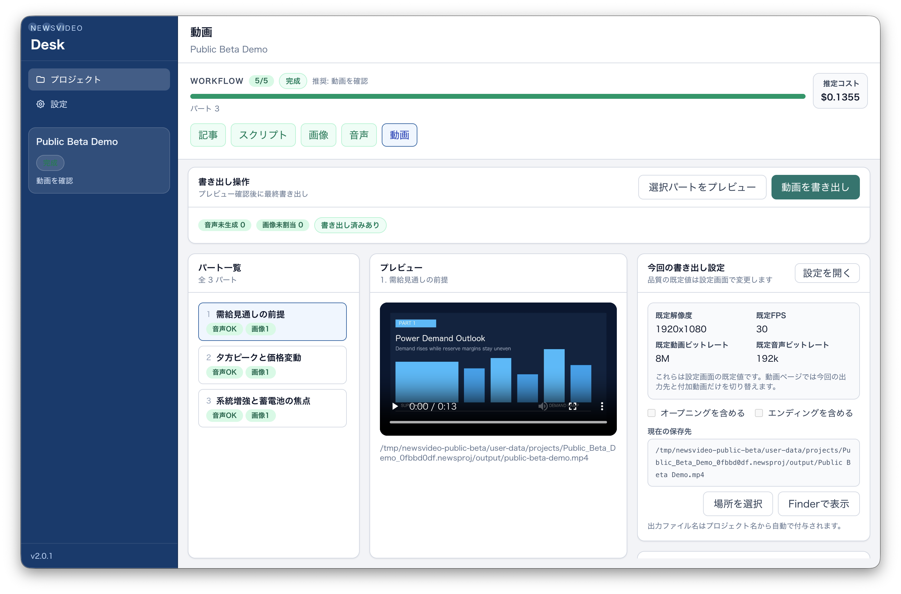

# NewsVideo

NewsVideo は、ニュース記事や解説記事からナレーション付き動画を作るための `macOS / Apple Silicon` 向けデスクトップアプリです。記事を貼り付けて「おまかせで作る」を押すと、台本・画像・音声を AI が作り、動画に仕上げます。各シーンは台本・画像・音声の画面で個別に直せます。

これは個人開発の `OSS Public Beta` です。配布版は self-serve 前提で、サポートは `best effort`、API 利用料はユーザー自身の契約に紐づきます。まずは `README`、`docs/クイックスタート.md`、`docs/FAQとトラブルシュート.md` を見ながら、自分で試せる人向けに公開しています。

## サポート方針

- NewsVideo は個人開発の `OSS Public Beta` です
- サポートは `best effort` で、個別環境ごとの無償セットアップ支援や運用代行は行いません
- まず `README`、`docs/クイックスタート.md`、`docs/対応環境と制約.md` を確認し、そのうえで再現条件がある場合のみ Issue をお願いします
- 外部 API の障害、課金、モデル仕様変更に対して即時対応は保証しません

## 現在サポートしないもの

- `Windows` / `Linux` 向けの利用案内や公式配布
- `Intel Mac` 向けの公式配布
- 個別環境ごとの手厚いセットアップ支援
- 外部 API 障害やモデル仕様変更への即時追従
- 生成結果の固定品質保証や商用 SaaS 相当の継続サポート

## できること

- 記事を貼り付けて「おまかせで作る」を押すだけで、台本 → 画像 → 音声 → 動画まで自動で作る
- 自動生成の進み具合を、どの画面にいても画面上部で確認する(停止・続きからの再開もここから)
- 作る前に費用の見込みを確認し、生成中は今回の費用と見込み、完成時は今回かかった費用(推定)と内訳を確認する(円とドルを併記)
- これまでに使った費用を、`設定 > 使った費用` で月別・サービス別に確認する(動画を削除しても記録は残る)
- 新しく作る動画の既定値(最初に選ぶ用途・画像の雰囲気・話し方・締め・出典の表示・進め方と予算)を `設定 > 新しい動画` で決める
- 用途(ニュース / 解説 / ショート)、シーン数、1 シーンの長さ、締めのひとこと、画像の雰囲気、画面の縦横、読み上げの話し方を、記事画面の「詳細設定」でその動画だけ調整する
- 各シーンの台本・画像・音声を、それぞれの画面で直したり作り直したりする
- 読み間違える言葉の読みを「読み辞書」に登録する(全プロジェクト共通)
- 動画ごとに締めカードや出典表示を調整し、共通の最初・最後に流す動画と組み合わせて書き出す
- プロジェクト単位で途中経過を自動保存し、あとから再開する
- API キーなしで、完成サンプルを開いて操作を試す

## 想定ユーザー

- ニュース解説動画を短時間で組み立てたい個人制作者
- 記事ベースの動画試作を高速に回したい編集者や小規模チーム
- SaaS に素材を預けるより、ローカルアプリで制作フローを持ちたい人

## ワークフロー

1. `プロジェクト` 画面で「新しい動画を作る」を押し、動画の種類を選ぶ
2. `記事` 画面にタイトルと本文を貼り付ける(必要なら「詳細設定」を開いて調整する)
3. 費用の目安を確認して「おまかせで作る」を押す
4. 画面上部の進み具合を見ながら待つ(ほかの画面に移っても止まらない)
5. 完成の通知から「動画を見る」を押し、動画画面で確認して書き出す

直したいシーンがあるときは、`記事 → 台本 → 画像 → 音声 → 動画` の各画面で個別に作り直せます。

## 使い始める

### 配布版を使う

- 最新版は [GitHub Releases](https://github.com/aoyaman41/NewsVideo/releases/latest) から取得できます
- 現時点の公式配布は `macOS / Apple Silicon (arm64)` 向けです
- 最短手順は [docs/クイックスタート.md](docs/クイックスタート.md) にまとめています
- 初回起動時の Gatekeeper 警告と回避手順は [docs/macOSインストールとGatekeeper.md](docs/macOSインストールとGatekeeper.md) を確認してください
- 対応環境と Public Beta の制約は [docs/対応環境と制約.md](docs/対応環境と制約.md) を確認してください

### 初回設定

1. アプリを起動すると「ようこそ」画面が開きます
2. `Anthropic`・`OpenAI`・`Google` の 3 つの API キーを、画面の案内(取得先のリンク → 貼り付け → 「保存して確認」)に沿って設定します
3. 3 つとも「使えます」になったら「はじめる」を押します

補足:

- 既定の構成は、文章(台本と画像の指示)が `Claude Opus 5.5`、画像が `GPT Image 2.5 Sunburst`、音声が `Gemini 3.8 Flash TTS` です
- `設定 > 生成モデル` で用途ごとにモデルを変えられます。必要な API キーはモデルに合わせて変わります(例: 文章と画像を Gemini にすると、Google のキー 1 つで使えます)
- キーがなくても「サンプルを見る」で完成サンプルを試せます。あとから `設定 > API キー` で設定できます
- 自動生成の進め方と予算の既定値は `設定 > 新しい動画`、「思考の深さ」(既定は「中」)、フレームレート、ビットレート(既定は自動)などは `設定 > 詳細設定` にあります
- API 利用料は NewsVideo ではなく、各プロバイダの契約に対して直接発生します

### 最初の 1 本を作る

1. `プロジェクト` 画面で「新しい動画を作る」を押し、動画の種類を選んで「作成して記事を入力する」を押す
2. 記事のタイトルと本文を貼り付ける。サンプルで試す場合は [docs/サンプル記事.md](docs/サンプル記事.md) をそのまま使う
3. 「おまかせで作る」を押す
4. 完成したら画面上部の「動画を見る」から動画画面を開き、確認して書き出す

詳しくは [docs/クイックスタート.md](docs/クイックスタート.md) を参照してください。

## 開発者向けセットアップ

必要環境:

- Node.js `^20.19.0` または `>=22.12.0`
- macOS

起動:

```bash
npm install
npm run dev
```

ビルド:

```bash
npm run build
```

確認用コマンド:

```bash
npm run lint
npm run typecheck
npm test
```

## プレビューとサンプル

- 画面をつないだ短いデモ: [workflow-demo.gif](.github/assets/public-beta/workflow-demo.gif)
- 公開用のサンプル入力 / 出力まとめ: [docs/サンプル出力.md](docs/サンプル出力.md)
- 記事入力済みのサンプルプロジェクト: [docs/サンプルプロジェクト.md](docs/サンプルプロジェクト.md)
- リリース前の最低限チェック: [docs/リリース前スモークテスト.md](docs/リリース前スモークテスト.md)
- 最新の配布物: [GitHub Releases](https://github.com/aoyaman41/NewsVideo/releases/latest)
- 検証用の入力例: [docs/サンプル記事.md](docs/サンプル記事.md)
- 公開用素材の再生成: `npm run docs:public-assets`



| Project list | Article input |
| --- | --- |
|  |  |
| Image workflow | Video export |
|  |  |

スクリーンショットと GIF は、機密情報や API キーが映らないように隔離プロファイルから自動生成しています。GitHub Releases に添付する場合も `.github/assets/public-beta/` 配下の同じファイルをそのまま使えます。

## 対応環境と制約

- 現時点の公式配布は `macOS / Apple Silicon (arm64)` のみです
- `Windows`、`Linux`、`Intel Mac` 向けの公式配布物はありません
- Public Beta のためサポートは `best effort` です
- 個別環境の無償セットアップ支援や商用サポートは行いません
- AI 生成機能を使うにはインターネット接続とユーザー自身の API キーが必要です
- 画像の雰囲気と画面の縦横はプロジェクトごとに選べます
- 動画画面の締めカードや出典表示はプロジェクトごとに保存されます
- 設定画面の「最初に流す動画」「最後に流す動画」はアプリ全体の共通素材です
- 既存プロジェクトに `presentationProfile` がない場合は `news + preset closing` 互換で読み込みます
- `closing card` 系の設定がない既存 project は、互換性のため最初は `締めカードなし` で読み込みます
- 現行の配布フローでは `Developer ID` 署名と `notarization` を意図的に見送っています
- 理由: 個人開発 OSS の現状では Apple Developer Program の年額コストと運用負荷に見合わないためです
- 詳細は [docs/対応環境と制約.md](docs/対応環境と制約.md) にまとめています

## データ取り扱いの概要

- プロジェクトデータはローカルのアプリ用ディレクトリに保存されます
- API キーは Electron の `safeStorage` を使ってローカル暗号化保存します
- 記事本文、生成プロンプト、音声生成用テキストは、生成時に選択した外部 API に送信されます
- 専用のテレメトリ送信やログ収集は現時点ではありません

詳細は [docs/データ取り扱い.md](docs/データ取り扱い.md) にまとめています。

## ドキュメントとサポート

- 現行実装ガイド: [docs/現行実装ガイド.md](docs/現行実装ガイド.md)
- コンテンツカスタマイズ方針: [docs/コンテンツカスタマイズ方針.md](docs/コンテンツカスタマイズ方針.md)
- クイックスタート: [docs/クイックスタート.md](docs/クイックスタート.md)
- データ取り扱い: [docs/データ取り扱い.md](docs/データ取り扱い.md)
- 免責事項: [docs/免責事項.md](docs/免責事項.md)
- FAQ / トラブルシュート: [docs/FAQとトラブルシュート.md](docs/FAQとトラブルシュート.md)
- リリース前スモークテスト: [docs/リリース前スモークテスト.md](docs/リリース前スモークテスト.md)
- 公開リリース手順: [docs/公開リリース手順.md](docs/公開リリース手順.md)
- 対応環境と制約: [docs/対応環境と制約.md](docs/対応環境と制約.md)
- セキュリティ報告方針: [SECURITY.md](SECURITY.md)
- Issue を開く前に、サポート方針と対応範囲を確認してください
- バグ報告 / 要望 / 使い方の質問: [GitHub Issues](https://github.com/aoyaman41/NewsVideo/issues/new/choose)
- 開発参加の前提: [CONTRIBUTING.md](CONTRIBUTING.md)

## 免責事項

- NewsVideo は個人開発の `OSS Public Beta` で、`AS IS` かつ `best effort` で提供します
- 動作継続性、生成結果、外部 API 由来の障害や料金変更、将来の互換性は保証しません
- 法令上許される最大限の範囲で、本ソフトウェアの利用または利用不能に起因する端末不具合、データ消失、情報漏えい、業務停止、逸失利益、外部サービス障害、API 利用料金負担、その他一切の損害について責任を負いません
- 公開デモ素材はこのリポジトリ用の架空記事と自動生成図版で構成しており、確認した範囲では第三者ロゴ、写真、記事転載は含んでいません
- 詳細は [docs/免責事項.md](docs/免責事項.md) と [LICENSE](LICENSE) を確認してください

## License

- NewsVideo のソースコードライセンス: [LICENSE](LICENSE)
- 同梱する第三者コンポーネントの注意書き: [THIRD_PARTY_NOTICES.md](THIRD_PARTY_NOTICES.md)

## 制作ワークスペース

用途の選択、API キー不要の編集サンプル、入力の自動保存、再開できる自動生成、シーンごとの作り直し、読み辞書、素材込みバックアップに対応しています。[操作ガイド](docs/制作ワークスペースガイド.md)を参照してください。
