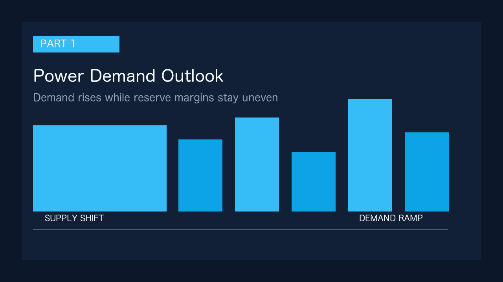
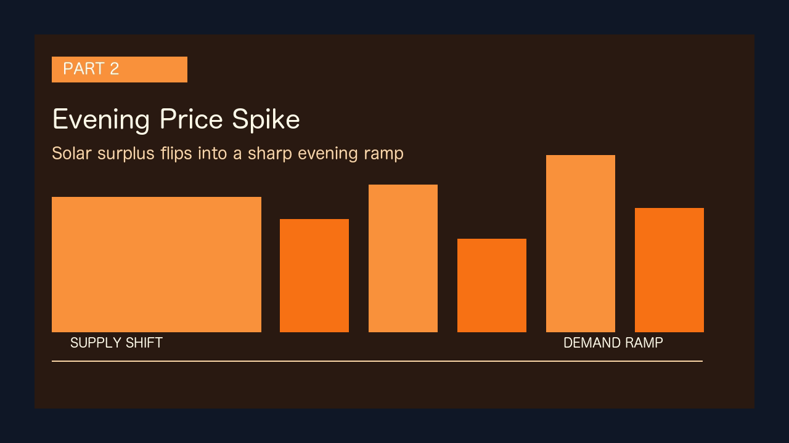
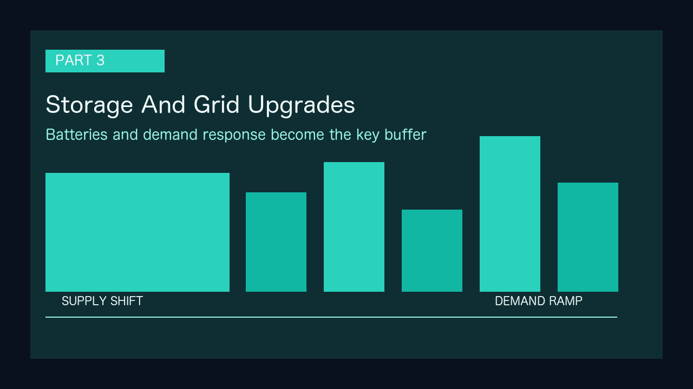

# サンプル出力（公開用）

NewsVideo を初めて見る人向けに、`docs/サンプル記事.md` を元にした公開用サンプルをまとめます。

## 対応する入力

- 入力記事: [docs/サンプル記事.md](./サンプル記事.md)
- 使用プロジェクト名: `Public Beta Demo`
- 画面素材と GIF の置き場: `.github/assets/public-beta/`

## 出力イメージ

### パート1



- タイトル: `需給見通しの前提`
- 役割: 需要増と供給余力の地域差を導入で整理する

### パート2



- タイトル: `夕方ピークと価格変動`
- 役割: 昼の余剰と夕方の価格急騰リスクを見せる

### パート3



- タイトル: `系統増強と蓄電池の焦点`
- 役割: 蓄電池、系統増強、需要家参加を締めに置く

## 台本例

```text
来夏の電力需給は全国では持ちこたえる見通しですが、需要が2パーセント増える前提で、地域ごとの余力には差が残ります。再エネ比率が上がるほど、単純に発電量を見るだけではなく、時間帯ごとの調整力をどう確保するかが重要になります。

昼間は太陽光で余剰が出やすい一方で、夕方は太陽光の出力が落ちるのに合わせて需要が立ち上がります。ここで火力や蓄電池の準備が足りないと、スポット価格が急騰しやすく、電力市場の不安定さが表面化します。

今後の焦点は、蓄電池の導入スピードと連系線増強の進み具合、そして需要家がピークカットにどれだけ参加できるかです。供給力の追加だけでなく、需要側の柔軟性を含めて運用できるかが、料金抑制と安定供給の分かれ目になります。
```

## 画像プロンプト例

```text
Create an infographic-style 16:9 visual about 需給見通しの前提. Show electricity demand, battery storage, and grid balancing in a clean editorial style.
```

## 公開素材の使い方

- README 掲載用: `workflow-demo.gif`, `project-list.png`, `article-input.png`, `image-workflow.png`, `video-export.png`
- GitHub Releases 添付用: `.github/assets/public-beta/` 配下をそのまま使用
- 再生成コマンド: `npm run docs:public-assets`

生成素材は隔離した `/tmp/newsvideo-public-beta` プロファイルから作っており、API キーや個人用プロジェクトは含みません。
